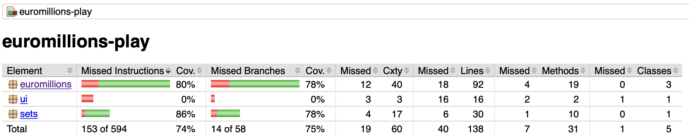

## Lab1_2
### Alinea E)

(O ficheiro HTML é gerado na pasta /target/site)

Os metodos que oferecem menos cobertura são essencialmente os metodos pre-feito pelo editor
de texto (equals, hasCode ...)
Quanto aos métodos desenvolvidos para a execução do exercício, os mesmos apresentam
uma convertura boa, pois têm testes desenvolvidos para esses mesmos testes.
Nem todas as decision branches são cobertas, no entanto a maioria são, sendo que as principais branches que nao sao cobertas, são as de funções já faladas anteriormente (equals, hasCode...).

